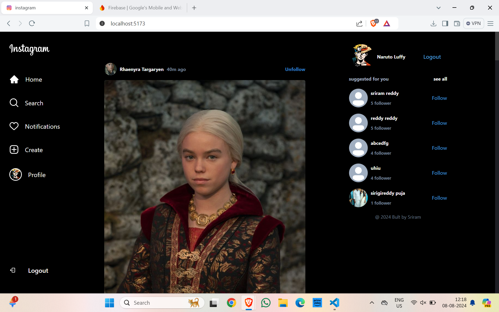

# Instagram Clone Application

This project is an Instagram clone website developed using ReactJS and JavaScript for the frontend, and Firebase for the backend. It includes features like user authentication, data storage for user profiles, and user posts.

## Features

- User authentication (Sign Up, Login, Logout)
- Posting photos with captions
- Viewing a feed of posts from all users
- Liking and commenting on posts
- Real-time updates using Firebase
- Responsive design for mobile and desktop





## Tech Stack

- **Frontend:**
  - ReactJS
  - JavaScript
  - Chakra UI
  - Redux Toolkit
  - React Router DOM
- **Backend:**
  - Firebase Authentication
  - Firebase Firestore (Database)
  - Firebase Storage (Image Storage)

## Installation

1. Clone the repository:
   ```bash
   git clone https://github.com/ksriramreddy/instagram-clone.git
   cd instagram-clone
